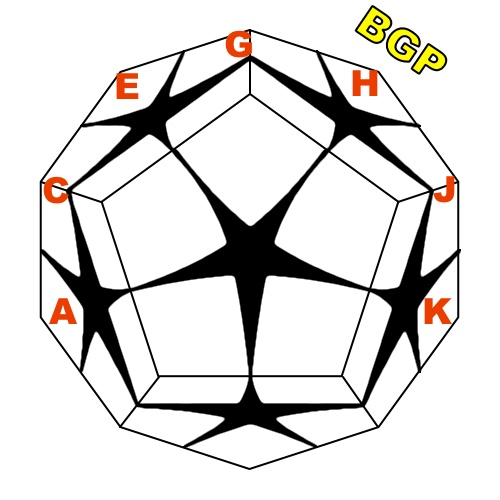

# Kilominx solver algorithm

This repository contains a modification of [xyzzy's scrambler](https://www.speedsolving.com/threads/kilominx-discussion-thread.61950/page-2#post-1188310)
with [Kit Clement's visualiser](https://www.speedsolving.com/threads/kilominx-discussion-thread.61950/post-1188632) 
aimed at reducing an amount of BL and BR moves used in scramble sequence

The colorscheme is fixed (white on top, green on front) 

For explanation purposes let's agree that color on B layer is grey; "flip" means x2; 
also, in the picutre below, I introduce names for *positions* on kilominx (A, C, E, G, H, J, K), 
and name a corner BGP, which is located at place H in solved state. In default colorscheme this is blue-light_green-pink corner.

- Phase 1: 
 Move all grey corners and BGP to positions A, C, E, G, H, J, K. If there are any grey corners or BGP on D layer - leave them there. 
In ~80% cases this phase can be solved 4-gen, in other ~20% – using one additional BL move

   (flip)

- Phase 2: 
 Solve grey face and place BGP to it's position. Because of phase 1, phase 2 can be solved 4-gen

   (flip)

- Phase 3:
 Solve four more corners at positions A, C, E, G. This phase is 5-gen. Notice that we have already placed BGP corner to it's position (H) 
 and we cannot accidentally destroy it, as we do not use BR moves. 

- Phase 4:
 Solve remaining pieces with <R,U,F> (3-gen)

Phase 1 can (probably) be solved pretty fast with bruteforce. Phases 2, 3, 4 would require separate move tables from each other to preserve turn.
